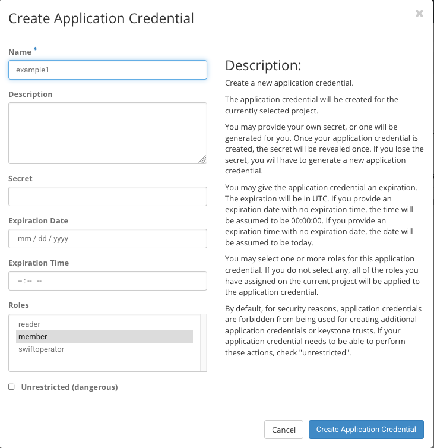
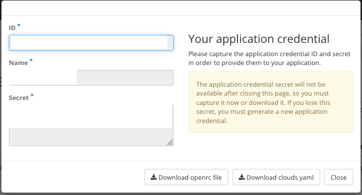

# Deploying the demo environment to an OpenStack account

## 1 Summary

I will detail how to build and deploy the demo environment to [NERC](https://nerc.rc.fas.harvard.edu/dashboard/auth/login/?next=/dashboard/) OpenStack platform.

These instructions are written for MacOS but should apply to Linux as well.

However, non-HMDC readers will need to make their own substitute `nerc.pkrvars.hcl`.

## 2 Pre-requisites

### 2.1 Access

Get an OpenStack account with NERC or another OpenStack compatible cloud with the following permissions (which you should already have):

* Permission to create application credentials in OpenStack Identity.

* ... to assign floating ip addresses or permission to deploy to a network that provides publicly routable IP addresses or
  
* ... to add OpenStack firewall rules.

If you're able to login to NERC but aren't sure about the other requirements, you can still proceed with the instructions and the errors encountered will eventually reveal if you have the requisite credentials.

### 2.2 Infrastructure pre-req

* Add a second-level wildcard domain for your project, such as
`*.xyz.h2.hmdc.harvard.edu`, by setting the DNS record A to the public IP address of your eventual H2 instance. Here, `xyz` is the assumed project name.

* You may pre-assign a floating ip in OpenStack to your project and use its IP address, or you may do so after the instance is booted.

### 2.3 Software pre-req

* `openstackclient`
* `packer`

On MacOS and WSL(?)

```shell
brew install openstackclient packer
```

## 3 Getting and loading OpenStack credentials

1. Login to NERC and [create a new set of application credentials](https://stack.nerc.mghpcc.org/dashboard/identity/application_credentials/) as shown below. Substitute `example1` with the name of your h2 environment which can be anything as long as its unique to the OS project in which you operate


